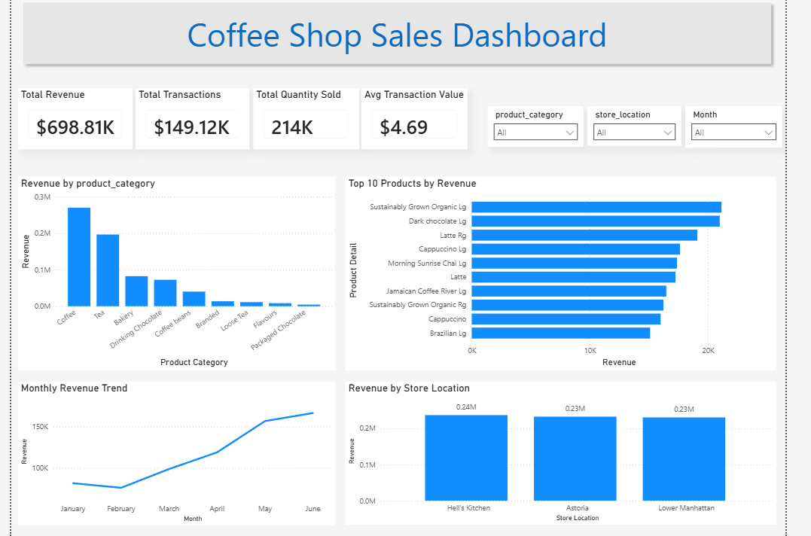

# Coffee-Shop-Sales-Dashboard
# ☕ Coffee Shop Sales Dashboard | Power BI

## 📌 Project Overview

This project is an interactive **Coffee Shop Sales Dashboard** built using **Microsoft Power BI**. The dashboard provides insights into sales performance, product performance, monthly revenue trends, and store performance, enabling business users to make data-driven decisions.

---

## 🎯 Objectives

* Analyze overall sales performance.
* Identify the top-performing product categories and products.
* Compare revenue across different store locations.
* Track monthly revenue trends.
* Build an interactive dashboard using slicers for dynamic filtering.

---

## 📂 Dataset

**Dataset:** Coffee Shop Sales Dataset

The dataset contains transactional sales data, including:

* Transaction Date
* Transaction Time
* Store Location
* Product Category
* Product Type
* Product Detail
* Unit Price
* Quantity Sold

---

## 🛠 Tools Used

* Microsoft Power BI
* Power Query (Data Cleaning & Transformation)
* DAX (Data Analysis Expressions)

---

## 📊 Key Performance Indicators (KPIs)

* Total Revenue
* Total Transactions
* Total Quantity Sold
* Average Transaction Value

---

## 📈 Dashboard Features

* Revenue by Product Category
* Top 10 Products by Revenue
* Monthly Revenue Trend
* Revenue by Store Location
* Interactive Slicers

  * Product Category
  * Store Location
  * Month

---

## 📷 Dashboard Preview

---

## 💡 Key Insights

* Coffee generated the highest revenue among all product categories.
* Revenue showed a steady upward trend from January to June.
* Hell's Kitchen was the highest revenue-generating store location.
* A small number of products contributed significantly to total revenue.
* Product Category, Store Location, and Month slicers allow users to interactively explore the data.

---

## 📚 Skills Demonstrated

* Data Cleaning
* Data Modeling
* DAX Measures
* KPI Development
* Dashboard Design
* Data Visualization
* Business Analysis
* Interactive Reporting

---

## 🚀 Future Improvements

* Add Year-over-Year (YoY) comparison.
* Include Profit and Profit Margin analysis.
* Add drill-through pages for detailed product analysis.
* Enhance dashboard with custom tooltips and bookmarks.

---

## 👩‍💻 Author

**Rashmi**

This project was created as part of my Data Analytics portfolio to demonstrate Power BI dashboard development and business intelligence skills.
